# October catalogue additions

Growing fields are now populated for **Sydney / warm temperate**. See [source notes](SOURCES.md) and [field provenance](localdata/plant-growing-sources.json). Estimates are labelled in each plant’s care notes. Exact yield weights remain unknown; harvest guidance is provided as text.

| Plant | Planting / propagation months | Plant / row spacing | Sun / water |
| --- | --- | --- | --- |
| Parsley | September–May, seed | 30 / 60 cm | Part shade / moderate |
| Okra | October–December, seed | 60 / 120 cm | Full sun / moderate |
| Lazy Housewife | September–January, seed | 20 / 100 cm | Full sun / moderate |
| Scarlet Runner | November–February, seed | 20 / 100 cm, provisional | Full sun / high |
| Sweet 1000 | August–December, general tomato seed guidance | 90 / 150 cm, general tomato layout | Full sun / moderate |
| Vietnamese Mint | September–February, cuttings | 45 / 60 cm, provisional | Part shade / high |
| Chocolate Mint | September–November, March–April, divisions | 60 / 65 cm, contained layout | Full sun / high |

Months are a regional guide, not a substitute for soil temperature, frost checks or seed-packet instructions.

Added 2 October 2026. These are public reference records, not personal garden history.

## Plants

### Parsley

Leafy biennial culinary herb, available in curly and flat-leaved forms.

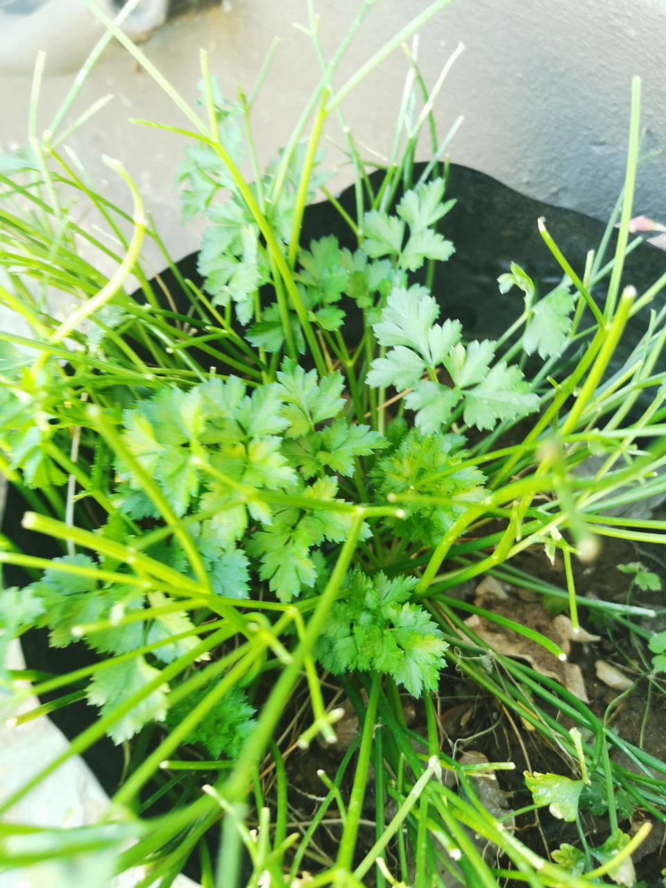

Parsley plant

Photo: Aisha.shipanga · [CC BY-SA 4.0](https://creativecommons.org/licenses/by-sa/4.0) · [source](https://commons.wikimedia.org/wiki/File:Parsley_plant.jpg)

[Growing reference](https://www.rhs.org.uk/herbs/parsley/grow-your-own)

### Okra

Heat-loving annual vegetable grown for tender immature pods.

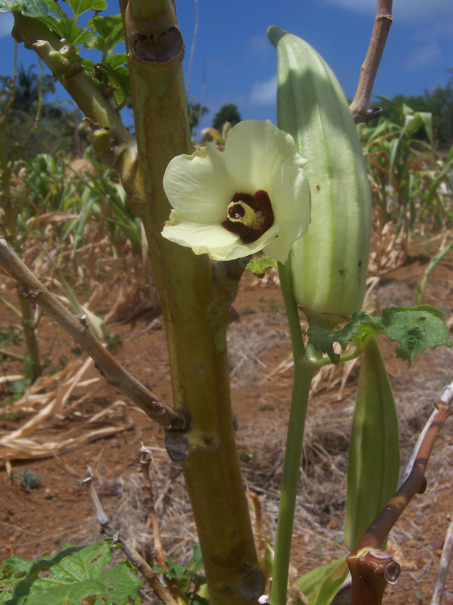

Okra flowers and developing pods

Photo: B.navez · [CC BY-SA 3.0](http://creativecommons.org/licenses/by-sa/3.0/) · [source](https://commons.wikimedia.org/wiki/File:Abelmoschus_esculentus_FruitandFlower.jpg)

[Growing reference](https://www.rhs.org.uk/vegetables/okra/grow-your-own)

### Bean - Lazy Housewife

Climbing bean with stringless young pods, grown on a sturdy support.

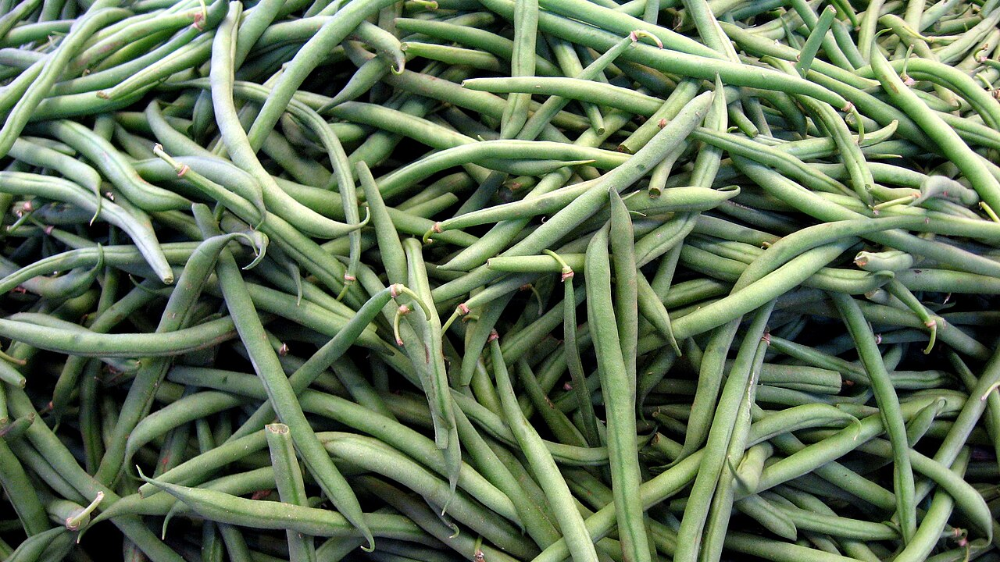

Representative common bean pods; Lazy Housewife cultivar not verified

Photo: 16:9clue · [CC BY 2.0](https://creativecommons.org/licenses/by/2.0) · [source](https://commons.wikimedia.org/wiki/File:Green_beans_169clue.jpg)

[Growing reference](https://greenpatchseeds.com.au/products/bean-climbing-lazy-housewife)

### Bean - Scarlet Runner

Climbing bean with scarlet flowers and long pods; can regrow from perennial roots in suitable conditions.

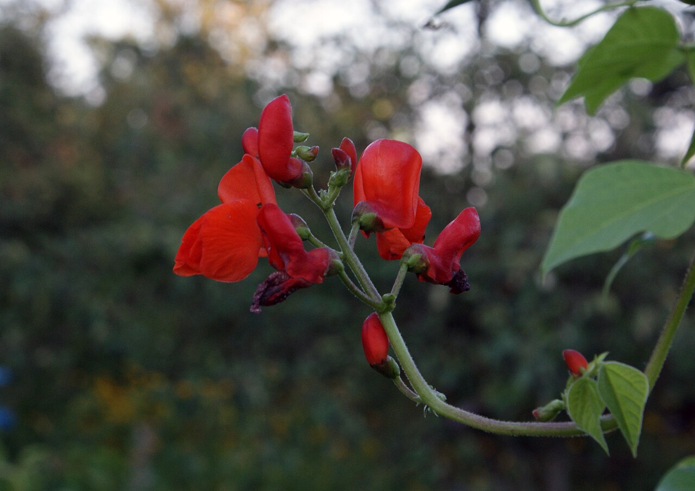

Scarlet runner bean flowers

Photo: Włodzimierz Wysocki · [CC BY-SA 3.0](https://creativecommons.org/licenses/by-sa/3.0) · [source](https://commons.wikimedia.org/wiki/File:Phaseolus_coccineus_flowers.JPG)

[Growing reference](https://www.yates.com.au/heirloom-beans-climbing-scarlet-runner/)

### Tomato - Sweet 1000

Tomato recorded under the requested Sweet 1000 name; cultivar-specific growing details still need confirmation.

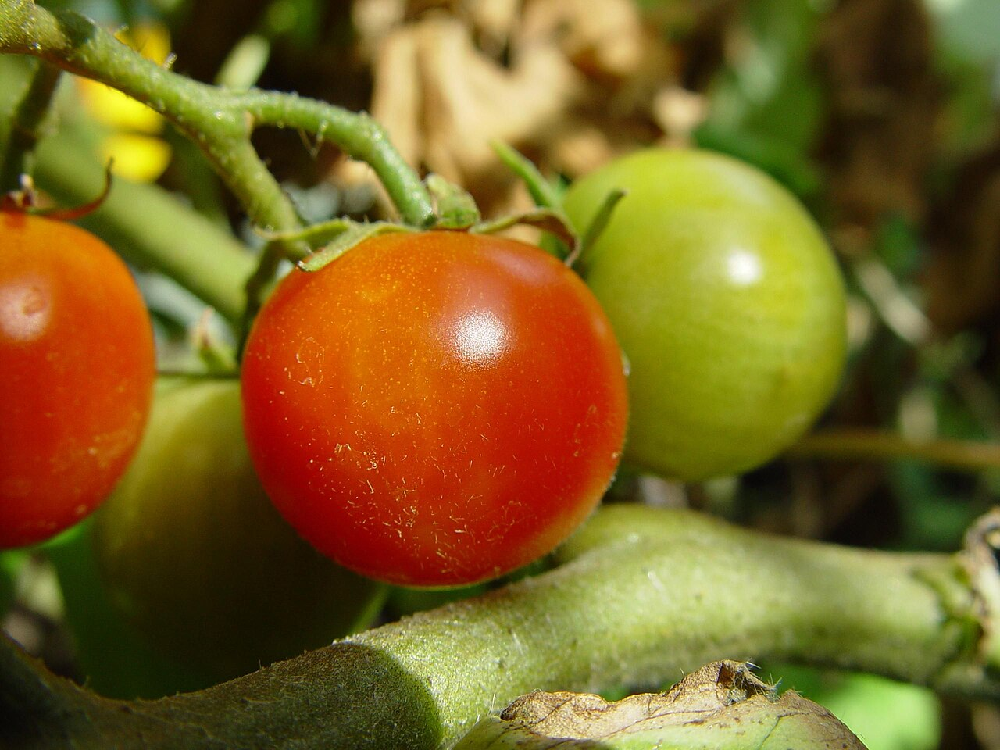

Representative tomato plant; Sweet 1000 cultivar not verified

Photo: Leon Brooks · [Public domain](https://creativecommons.org/publicdomain/mark/1.0/) · [source](https://commons.wikimedia.org/wiki/File:Cherry_tomatoes_plant.jpg)

[Growing reference](https://www.hrseeds.com/pepper-and-tomato-seed-list)

### Vietnamese Mint

Spreading perennial herb also called Vietnamese coriander or rau ram, with aromatic leaves used in cooking.

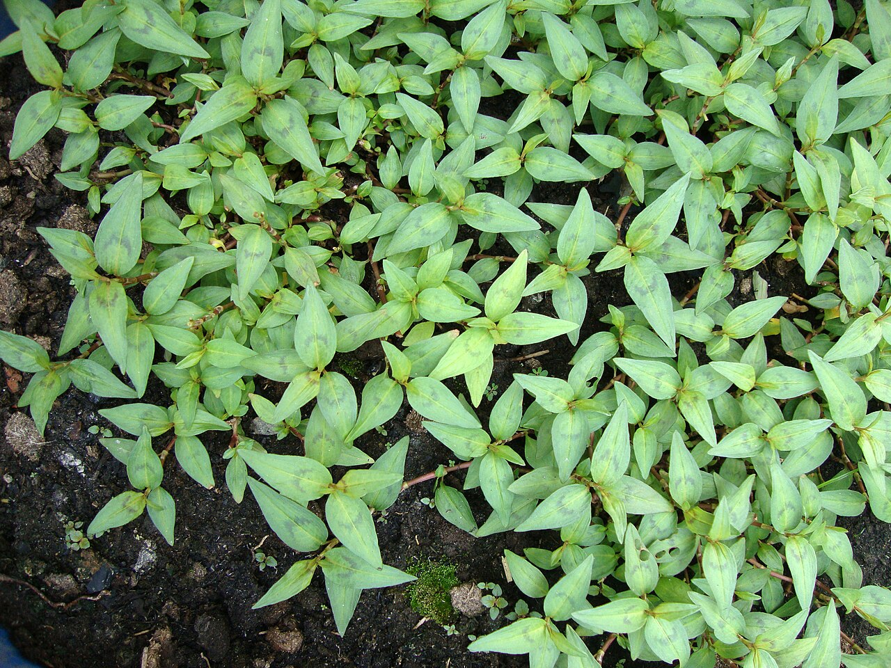

Vietnamese mint foliage

Photo: Prenn · [CC BY-SA 3.0](https://creativecommons.org/licenses/by-sa/3.0) · [source](https://commons.wikimedia.org/wiki/File:Persicaria_odorata_(2).JPG)

[Growing reference](https://www.rhs.org.uk/plants/118209/persicaria-odorata/details)

### Chocolate Mint

Vigorous perennial mint grown for aromatic leaves with a chocolate-mint scent.

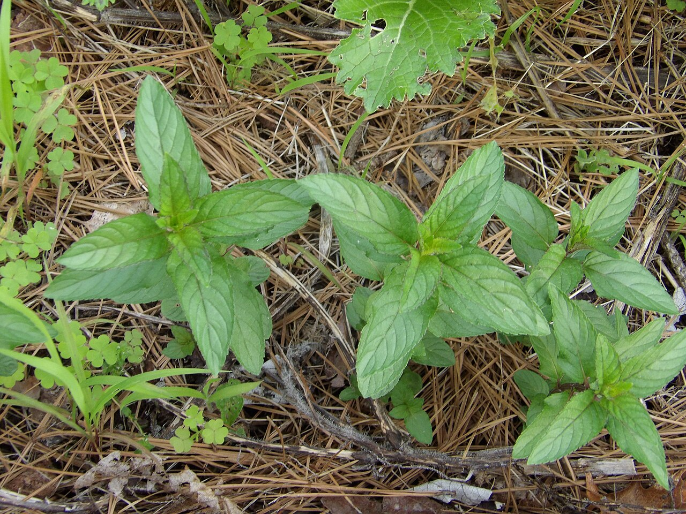

Chocolate mint foliage

Photo: Broly0 · [CC0](http://creativecommons.org/publicdomain/zero/1.0/deed.en) · [source](https://commons.wikimedia.org/wiki/File:Mentha_%C3%97_piperita_%27Chocolate_Mint%27.JPG)

[Growing reference](https://www.rhsplants.co.uk/plants/_/mentha--piperita-f-citrata-chocolate/classid.2000012671/)

## Pest and disease references

### Garden snail (Cornu aspersum)

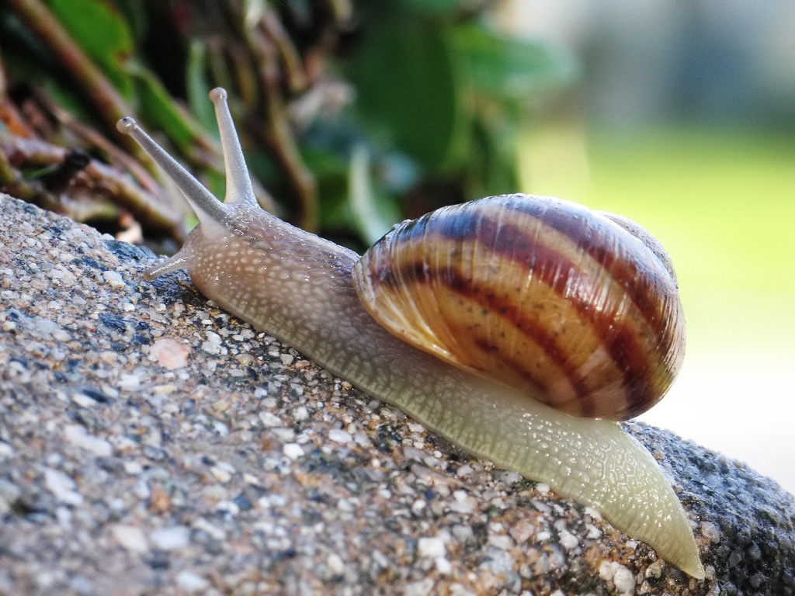

Photo: macrophile on Flickr · [CC BY 2.0](https://creativecommons.org/licenses/by/2.0) · [source](https://commons.wikimedia.org/wiki/File:Common_snail.jpg)

### Grey field slug (Deroceras reticulatum)

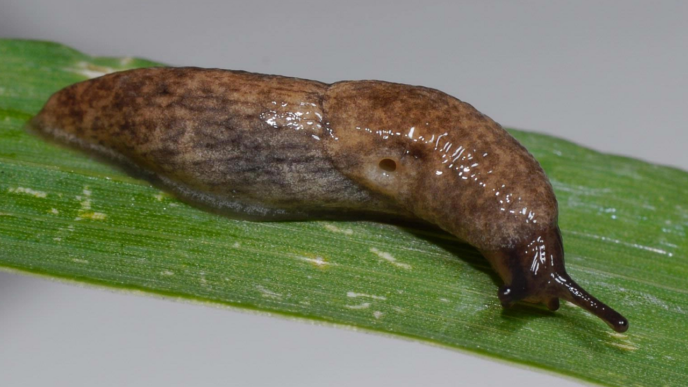

Photo: Joseph Berger · [CC BY 3.0 us](https://creativecommons.org/licenses/by/3.0/us/deed.en) · [source](https://commons.wikimedia.org/wiki/File:Deroceras_reticulatum.png)

### Aphid colony (Aphis fabae)

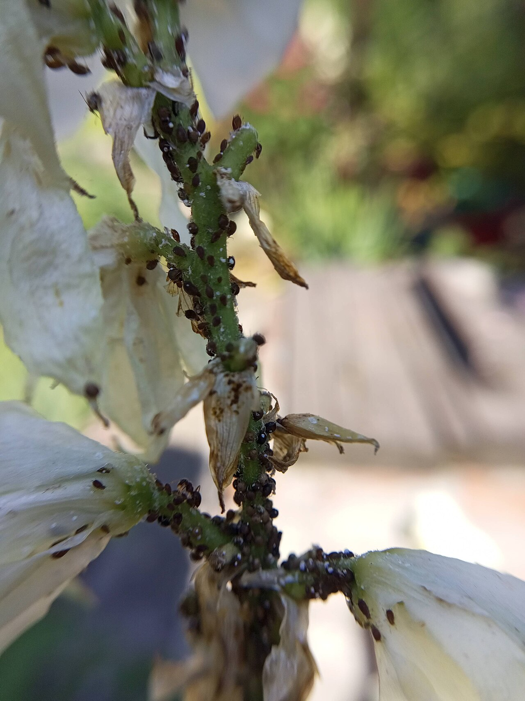

Photo: Natalka Ukraine ( baby-bear.org ) · [CC BY 4.0](https://creativecommons.org/licenses/by/4.0) · [source](https://commons.wikimedia.org/wiki/File:Aphis_fabae_colony_on_Yucca_filamentosa_in_Dnipro_by_baby-bear.org.jpg_01.jpg)

### Powdery mildew on a maple leaf; illustrative symptoms, not a diagnosis

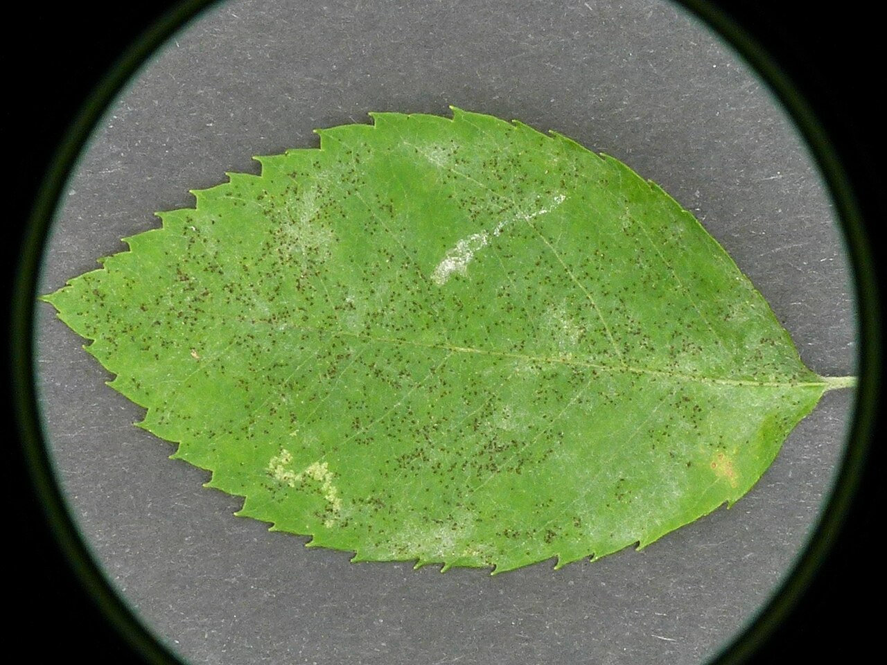

Photo: Norbert Nagel, Mörfelden-Walldorf, Germany · [CC BY-SA 3.0](https://creativecommons.org/licenses/by-sa/3.0) · [source](https://commons.wikimedia.org/wiki/File:Uncinula_tulasnei_-_powdery_mildew_-_Echter_Mehltau_01.jpg)
